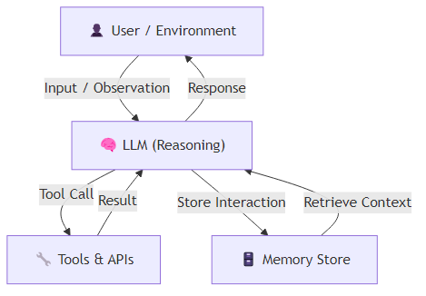
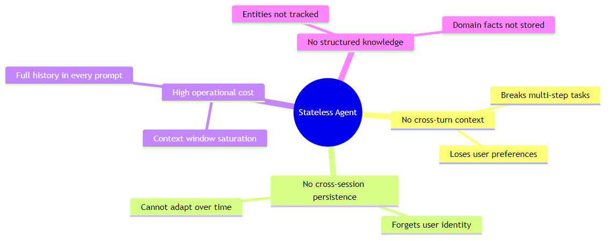
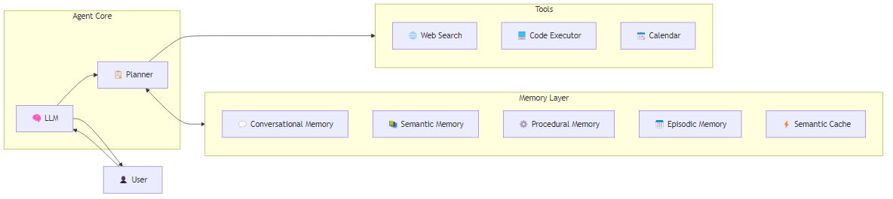
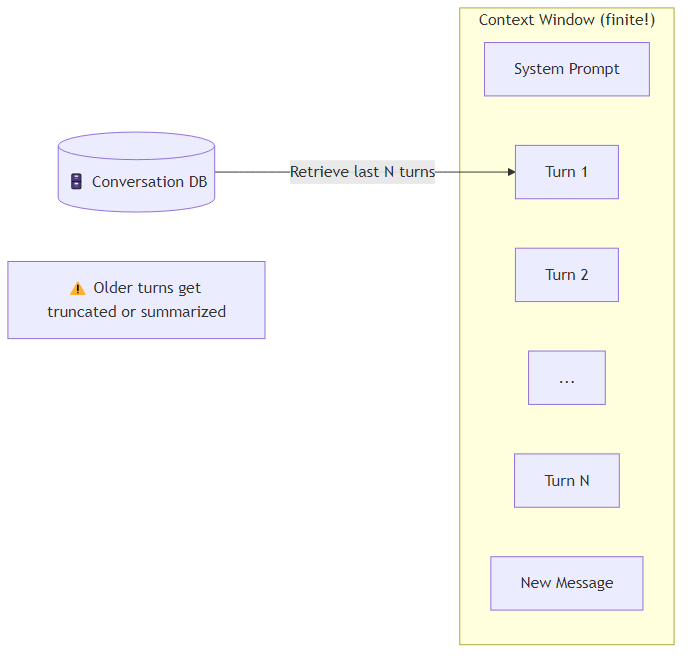
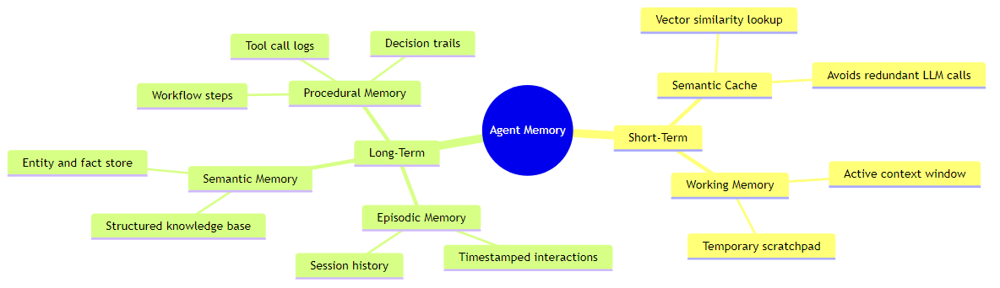
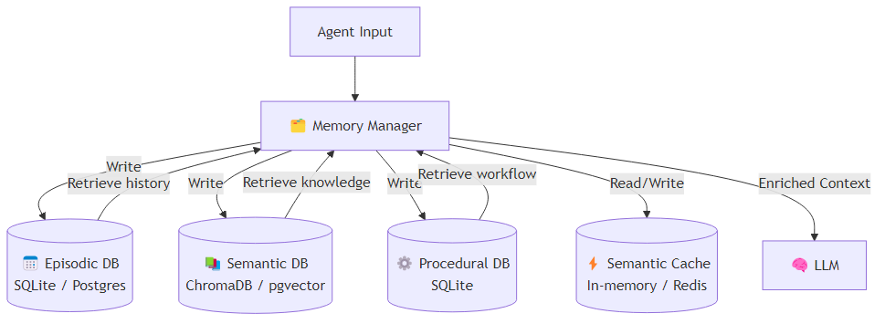
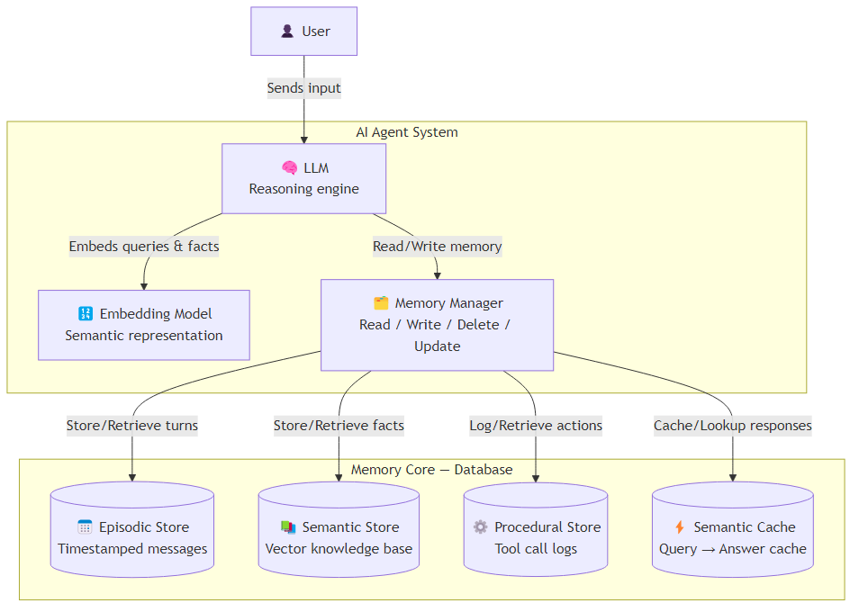
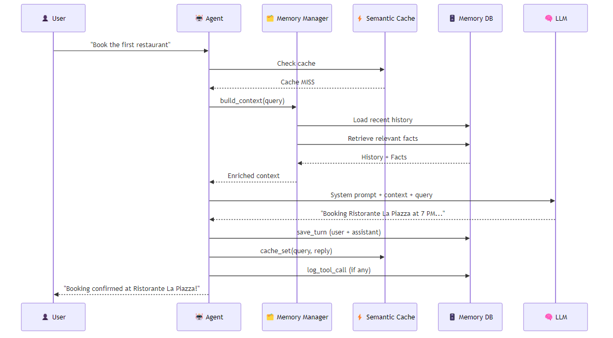

# Building Memory-Augmented AI Agents: A Complete Guide

> **Published:** April 5, 2026 | **Author:** *Anand Topu* | **Tags:** `AI Agents`, `LLM`, `Memory`, `RAG`, `Python`

> 📌 **Medium Publishing Note:** All diagrams are saved as PNG files in the `diagrams/` folder next to this file. When importing to Medium, upload each PNG image manually using Medium's image upload button and replace the placeholder image slots. Diagram files: `diagrams/01_agent_architecture.png` → `diagrams/08_end_to_end_flow.png`.

---

## Table of Contents

1. [What Is an AI Agent?](#1-what-is-an-ai-agent)
2. [The Problem with Stateless Agents](#2-the-problem-with-stateless-agents)
3. [Memory-Augmented Agents](#3-memory-augmented-agents)
4. [Conversational Memory](#4-conversational-memory)
5. [Types of Agent Memory](#5-types-of-agent-memory)
   - 5.1 [Short-Term Memory](#51-short-term-memory)
   - 5.2 [Long-Term Memory](#52-long-term-memory)
6. [The Memory Manager](#6-the-memory-manager)
7. [Agent Memory Core — The Database Layer](#7-agent-memory-core--the-database-layer)
8. [Putting It All Together: A Full Example](#8-putting-it-all-together-a-full-example)
9. [Key Takeaways](#9-key-takeaways)

---

## 1. What Is an AI Agent?

An AI agent is not just a chatbot — it is an **autonomous system** that perceives its environment, reasons with an LLM, acts through tools, and uses **memory** to carry knowledge across tasks and sessions.

```
Perceive → Reason → Act → Remember → Repeat
```

The four pillars of a capable agent:

| Pillar   | Description                                              |
|----------|----------------------------------------------------------|
| Perceive | Receives text, images, tool outputs, or sensor data      |
| Reason   | Uses an LLM to plan, evaluate, and decide                |
| Act      | Calls external tools (APIs, databases, code interpreters)|
| Remember | Stores and retrieves knowledge to maintain continuity    |

### High-Level Agent Architecture



---

## 2. The Problem with Stateless Agents

A **stateless agent** treats every turn as independent — it has no recollection of prior interactions. This leads to broken multi-turn conversations and skyrocketing costs because the full history must be repeated in every prompt.

### Example: Stateless Agent Failure

```python
# stateless_agent.py
from openai import OpenAI

client = OpenAI()  # requires OPENAI_API_KEY env var

def stateless_agent(user_message: str) -> str:
    """Each call is completely independent — no memory."""
    response = client.chat.completions.create(
        model="gpt-4o",
        messages=[
            {"role": "system", "content": "You are a helpful assistant."},
            {"role": "user",   "content": user_message},
        ]
    )
    return response.choices[0].message.content

# --- Simulated multi-turn conversation ---
turn1 = stateless_agent("Find me three Italian restaurants in Berlin.")
print("Turn 1:", turn1)

# Agent has FORGOTTEN Turn 1 entirely
turn2 = stateless_agent("Book a table at the first one for tonight.")
print("Turn 2:", turn2)
# ❌ The agent doesn't know what "the first one" refers to!
```

**Output (typical):**
```
Turn 1: Here are three Italian restaurants in Berlin: ...
Turn 2: I'm sorry, I don't have context about which restaurant you mean.
        Could you please specify the name?
```

### Failure Modes of Stateless Agents



---

## 3. Memory-Augmented Agents

By attaching an **external memory store**, the agent can read relevant history and write new observations — enabling true continuity.

### Architecture Diagram



### Simple Memory-Augmented Agent

```python
# memory_agent.py
from openai import OpenAI
from datetime import datetime

client = OpenAI()

# In-memory store (replace with a DB in production)
conversation_history: list[dict] = []

def memory_augmented_agent(user_message: str) -> str:
    """Agent that remembers the full conversation within a session."""

    # 1. Add user message to history
    conversation_history.append({
        "role": "user",
        "content": user_message,
        "timestamp": datetime.utcnow().isoformat()
    })

    # 2. Build messages for the LLM (system + full history)
    messages = [{"role": "system", "content": "You are a helpful assistant."}]
    messages += [
        {"role": m["role"], "content": m["content"]}
        for m in conversation_history
    ]

    # 3. Call LLM
    response = client.chat.completions.create(
        model="gpt-4o",
        messages=messages
    )
    reply = response.choices[0].message.content

    # 4. Store assistant reply in history
    conversation_history.append({
        "role": "assistant",
        "content": reply,
        "timestamp": datetime.utcnow().isoformat()
    })

    return reply

# --- Now the agent remembers! ---
print(memory_augmented_agent("Find me three Italian restaurants in Berlin."))
print(memory_augmented_agent("Book a table at the first one for tonight at 7 PM."))
# ✅ The agent recalls the restaurant list from Turn 1
```

---

## 4. Conversational Memory

Conversational memory stores time-ordered **user + assistant message pairs** and retrieves them into the LLM context window. It is the most commonly implemented form of agent memory.

### Storing Conversations in SQLite

```python
# episodic_store.py
import sqlite3
from datetime import datetime

DB_PATH = "agent_memory.db"

def init_db():
    con = sqlite3.connect(DB_PATH)
    con.execute("""
        CREATE TABLE IF NOT EXISTS conversations (
            id        INTEGER PRIMARY KEY AUTOINCREMENT,
            session   TEXT    NOT NULL,
            role      TEXT    NOT NULL,   -- 'user' | 'assistant'
            content   TEXT    NOT NULL,
            timestamp TEXT    NOT NULL
        )
    """)
    con.commit()
    con.close()

def save_message(session_id: str, role: str, content: str):
    con = sqlite3.connect(DB_PATH)
    con.execute(
        "INSERT INTO conversations (session, role, content, timestamp) VALUES (?,?,?,?)",
        (session_id, role, content, datetime.utcnow().isoformat())
    )
    con.commit()
    con.close()

def load_history(session_id: str, limit: int = 20) -> list[dict]:
    """Retrieve the last N messages for a given session."""
    con = sqlite3.connect(DB_PATH)
    rows = con.execute(
        """SELECT role, content FROM conversations
           WHERE session = ?
           ORDER BY id DESC LIMIT ?""",
        (session_id, limit)
    ).fetchall()
    con.close()
    # Return in chronological order
    return [{"role": r[0], "content": r[1]} for r in reversed(rows)]


# Usage
init_db()
save_message("session-42", "user", "What is the capital of France?")
save_message("session-42", "assistant", "The capital of France is Paris.")

history = load_history("session-42")
print(history)
# [{'role': 'user', 'content': 'What is the capital of France?'},
#  {'role': 'assistant', 'content': 'The capital of France is Paris.'}]
```

### Context Window Limitations



> **Best Practice:** Summarize old turns periodically and store the summary as a compressed episodic record. Retrieve the summary + recent raw turns for each new call.

---

## 5. Types of Agent Memory

Agents need more than chat logs. The full memory taxonomy maps closely to how **human memory** is categorized in cognitive science.



---

### 5.1 Short-Term Memory

#### Semantic Cache

A semantic cache stores **question → answer** pairs as vector embeddings. When a new query arrives, the cache checks cosine similarity against stored queries. If the similarity exceeds a threshold, the cached answer is returned — **no LLM call needed**.

```python
# semantic_cache.py
import numpy as np
from openai import OpenAI

client = OpenAI()

def embed(text: str) -> list[float]:
    """Get embedding vector for a text string."""
    resp = client.embeddings.create(
        model="text-embedding-3-small",
        input=text
    )
    return resp.data[0].embedding

def cosine_similarity(a: list[float], b: list[float]) -> float:
    a, b = np.array(a), np.array(b)
    return float(np.dot(a, b) / (np.linalg.norm(a) * np.linalg.norm(b)))

class SemanticCache:
    def __init__(self, threshold: float = 0.92):
        self.threshold = threshold
        self.store: list[dict] = []  # [{query, embedding, answer}]

    def get(self, query: str) -> str | None:
        q_emb = embed(query)
        for entry in self.store:
            sim = cosine_similarity(q_emb, entry["embedding"])
            if sim >= self.threshold:
                print(f"  [Cache HIT] similarity={sim:.3f}")
                return entry["answer"]
        return None  # Cache miss

    def set(self, query: str, answer: str):
        self.store.append({
            "query":     query,
            "embedding": embed(query),
            "answer":    answer
        })

# --- Usage ---
cache = SemanticCache(threshold=0.92)

def cached_llm_call(query: str) -> str:
    cached = cache.get(query)
    if cached:
        return cached  # Return without calling LLM

    # LLM call on cache miss
    resp = client.chat.completions.create(
        model="gpt-4o",
        messages=[{"role": "user", "content": query}]
    )
    answer = resp.choices[0].message.content
    cache.set(query, answer)
    return answer

print(cached_llm_call("What is the speed of light?"))
# → LLM called, result cached

print(cached_llm_call("How fast does light travel?"))
# → [Cache HIT] — semantically equivalent query served instantly
```

#### Working Memory (Scratchpad)

```python
# working_memory.py — agent scratchpad for multi-step reasoning

class WorkingMemory:
    """Temporary in-context scratchpad for a single agent run."""

    def __init__(self):
        self._notes: list[str] = []

    def note(self, observation: str):
        self._notes.append(observation)

    def as_text(self) -> str:
        if not self._notes:
            return "No notes yet."
        return "\n".join(f"- {n}" for n in self._notes)

    def clear(self):
        self._notes.clear()

# Example: agent solving a multi-step task
wm = WorkingMemory()
wm.note("User wants to book Italian restaurant in Berlin.")
wm.note("Found: Ristorante La Piazza, Trattoria Roma, Bella Italia.")
wm.note("User selected: Ristorante La Piazza.")
wm.note("Available slots: 7 PM, 8 PM.")

print("Current scratchpad:\n", wm.as_text())
```

---

### 5.2 Long-Term Memory

#### Episodic Memory

Episodic memory captures **what happened, when, and between whom**. The SQLite implementation above is a solid foundation. For production, consider PostgreSQL with a `pgvector` extension to allow semantic retrieval of past episodes.

#### Semantic Memory — Vector Knowledge Base

Semantic memory stores **domain knowledge and entity facts** that cannot be derived from chat logs. A vector database enables semantic retrieval.

```python
# semantic_memory.py
# pip install chromadb openai

import chromadb
from openai import OpenAI

client = OpenAI()
chroma = chromadb.Client()
collection = chroma.get_or_create_collection("agent_knowledge")

def add_knowledge(doc_id: str, text: str, metadata: dict | None = None):
    """Embed and store a knowledge chunk."""
    resp = client.embeddings.create(
        model="text-embedding-3-small",
        input=text
    )
    embedding = resp.data[0].embedding
    collection.add(
        ids=[doc_id],
        embeddings=[embedding],
        documents=[text],
        metadatas=[metadata or {}]
    )

def retrieve_knowledge(query: str, top_k: int = 3) -> list[str]:
    """Retrieve the most relevant knowledge chunks for a query."""
    resp = client.embeddings.create(
        model="text-embedding-3-small",
        input=query
    )
    query_emb = resp.data[0].embedding
    results = collection.query(query_embeddings=[query_emb], n_results=top_k)
    return results["documents"][0]

# --- Populate semantic memory ---
add_knowledge("fact-1",  "Berlin has a population of approximately 3.7 million people.",
              {"category": "geography"})
add_knowledge("fact-2",  "Ristorante La Piazza is located in Mitte district, Berlin.",
              {"category": "restaurant"})
add_knowledge("fact-3",  "The user prefers vegan options when dining out.",
              {"category": "user_preference"})

# --- Query ---
docs = retrieve_knowledge("restaurant recommendations Berlin")
for d in docs:
    print("•", d)
```

#### Procedural Memory — Logging Tool Calls and Decisions

```python
# procedural_memory.py
import json
import sqlite3
from datetime import datetime

DB_PATH = "agent_memory.db"

def log_tool_call(session_id: str, tool_name: str,
                   inputs: dict, outputs: dict, reasoning: str):
    """Record every tool call with its context and outcome."""
    con = sqlite3.connect(DB_PATH)
    con.execute("""
        CREATE TABLE IF NOT EXISTS tool_calls (
            id        INTEGER PRIMARY KEY AUTOINCREMENT,
            session   TEXT,
            tool      TEXT,
            inputs    TEXT,
            outputs   TEXT,
            reasoning TEXT,
            timestamp TEXT
        )
    """)
    con.execute(
        "INSERT INTO tool_calls VALUES (NULL,?,?,?,?,?,?)",
        (session_id, tool_name,
         json.dumps(inputs), json.dumps(outputs),
         reasoning, datetime.utcnow().isoformat())
    )
    con.commit()
    con.close()

def get_procedure_log(session_id: str) -> list[dict]:
    """Retrieve all tool calls for a session."""
    con = sqlite3.connect(DB_PATH)
    rows = con.execute(
        "SELECT tool, inputs, outputs, reasoning, timestamp FROM tool_calls WHERE session=? ORDER BY id",
        (session_id,)
    ).fetchall()
    con.close()
    return [
        {"tool": r[0], "inputs": json.loads(r[1]),
         "outputs": json.loads(r[2]), "reasoning": r[3], "ts": r[4]}
        for r in rows
    ]

# Example log
log_tool_call(
    session_id="session-42",
    tool_name="web_search",
    inputs={"query": "Italian restaurants Berlin"},
    outputs={"results": ["Ristorante La Piazza", "Trattoria Roma"]},
    reasoning="User asked for restaurant options; used web_search to find current listings."
)
```

---

## 6. The Memory Manager

The **Memory Manager** is the control layer that orchestrates all memory types. It decides:
- **What** to store (filtering noise vs. important facts)
- **Where** to store it (which memory type)
- **When** to retrieve (before LLM call, triggered by keywords)
- **How long** to retain it (TTL, compression, archiving)



```python
# memory_manager.py
from datetime import datetime
from semantic_cache    import SemanticCache
from episodic_store    import save_message, load_history
from semantic_memory   import add_knowledge, retrieve_knowledge
from procedural_memory import log_tool_call, get_procedure_log

class MemoryManager:
    """Unified interface for all memory types."""

    def __init__(self, session_id: str):
        self.session_id = session_id
        self.cache = SemanticCache(threshold=0.92)

    # ── Episodic ──────────────────────────────────────────────
    def save_turn(self, role: str, content: str):
        save_message(self.session_id, role, content)

    def get_recent_history(self, limit: int = 20) -> list[dict]:
        return load_history(self.session_id, limit)

    # ── Semantic ──────────────────────────────────────────────
    def remember_fact(self, doc_id: str, text: str, meta: dict = None):
        add_knowledge(doc_id, text, meta)

    def recall_facts(self, query: str, top_k: int = 3) -> list[str]:
        return retrieve_knowledge(query, top_k)

    # ── Procedural ────────────────────────────────────────────
    def log_action(self, tool: str, inputs: dict,
                   outputs: dict, reasoning: str):
        log_tool_call(self.session_id, tool, inputs, outputs, reasoning)

    def get_workflow(self) -> list[dict]:
        return get_procedure_log(self.session_id)

    # ── Semantic Cache ────────────────────────────────────────
    def cache_get(self, query: str) -> str | None:
        return self.cache.get(query)

    def cache_set(self, query: str, answer: str):
        self.cache.set(query, answer)

    # ── Build enriched context for LLM ───────────────────────
    def build_context(self, current_query: str) -> str:
        history = self.get_recent_history(limit=10)
        facts   = self.recall_facts(current_query, top_k=3)

        history_text = "\n".join(
            f"{m['role'].upper()}: {m['content']}" for m in history
        )
        facts_text = "\n".join(f"• {f}" for f in facts)

        return (
            f"## Conversation History\n{history_text}\n\n"
            f"## Relevant Knowledge\n{facts_text}"
        )
```

---

## 7. Agent Memory Core — The Database Layer

The **Agent Memory Core** is the database, which is considered the true backbone of agent memory because it:
- Stores the **majority of the agent's information**
- Handles the most **data traffic**
- Enables **scalable, queryable long-term memory**
- Supports **multiple memory types** as separate tables/collections



### Choosing the Right Database

| Memory Type      | Recommended Storage               | Why                                     |
|------------------|-----------------------------------|-----------------------------------------|
| Episodic         | PostgreSQL / SQLite                | Structured queries, time ordering       |
| Semantic         | ChromaDB / pgvector / Pinecone     | Vector similarity search                |
| Procedural       | PostgreSQL / SQLite                | Relational queries, audit logs          |
| Semantic Cache   | Redis (+ vector plugin) / in-memory | Sub-millisecond lookup                 |
| Working Memory   | In-process Python object           | Ephemeral, session-scoped               |

---

## 8. Putting It All Together: A Full Example

Here is a complete **memory-augmented agent** that uses all memory types together.

```python
# full_agent.py
# pip install openai chromadb numpy

from openai import OpenAI
from memory_manager import MemoryManager
from episodic_store import init_db

# --- Setup ---
client = OpenAI()
init_db()

def run_agent(session_id: str, user_input: str) -> str:
    mm = MemoryManager(session_id)

    # 1. Check semantic cache first
    cached = mm.cache_get(user_input)
    if cached:
        print("[Cache HIT] Returning cached response.")
        return cached

    # 2. Build enriched context from memory
    context = mm.build_context(user_input)

    # 3. Construct messages for LLM
    messages = [
        {
            "role": "system",
            "content": (
                "You are a helpful AI assistant with access to memory.\n\n"
                + context
            )
        },
        {"role": "user", "content": user_input}
    ]

    # 4. Call the LLM
    response = client.chat.completions.create(
        model="gpt-4o",
        messages=messages
    )
    reply = response.choices[0].message.content

    # 5. Persist to memory
    mm.save_turn("user",      user_input)
    mm.save_turn("assistant", reply)

    # 6. Cache the response
    mm.cache_set(user_input, reply)

    # 7. Extract and store key facts (could use a separate extraction agent)
    # mm.remember_fact(f"fact-{hash(user_input)}", f"User asked: {user_input}")

    return reply


# --- Run a multi-turn conversation ---
SESSION = "demo-session-001"

print("Response 1:", run_agent(SESSION, "I'm looking for Italian restaurants in Berlin."))
print("Response 2:", run_agent(SESSION, "Book a table at the first one for tonight at 7 PM."))
print("Response 3:", run_agent(SESSION, "What did I ask you earlier?"))
```

### End-to-End Flow Diagram



---

## 9. Key Takeaways

| Concept                  | Summary                                                                                     |
|--------------------------|---------------------------------------------------------------------------------------------|
| **Stateless Agent**      | No memory — fails at multi-turn tasks, high cost                                            |
| **Conversational Memory**| Stores ordered chat history — finite context window is a bottleneck                         |
| **Semantic Cache**       | Prevents redundant LLM calls via vector similarity — reduces latency and cost               |
| **Working Memory**       | Ephemeral session scratchpad for active reasoning                                           |
| **Episodic Memory**      | Timestamped interaction log — *what happened and when*                                      |
| **Semantic Memory**      | Structured knowledge & entity store — *facts about the world and the user*                  |
| **Procedural Memory**    | Tool call and decision audit trail — *how the agent solved a problem*                       |
| **Memory Manager**       | Unified control layer — routes reads/writes across all memory types                         |
| **Memory Core (DB)**     | The database is the backbone — stores most data, handles most traffic, enables scalability  |

> **Golden Rule:** A stateless agent is a smart autocomplete. A memory-augmented agent is a capable collaborator.

---

### Further Reading & Libraries

- 🔗 [LangChain Memory](https://python.langchain.com/docs/modules/memory/) — drop-in memory modules
- 🔗 [mem0](https://github.com/mem0ai/mem0) — dedicated memory layer for AI agents
- 🔗 [ChromaDB](https://www.trychroma.com/) — open-source vector database
- 🔗 [pgvector](https://github.com/pgvector/pgvector) — vector extension for PostgreSQL
- 🔗 [OpenAI Embeddings](https://platform.openai.com/docs/guides/embeddings) — `text-embedding-3-small`

---


